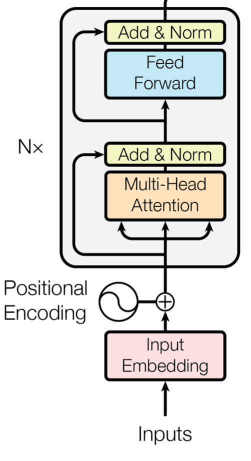
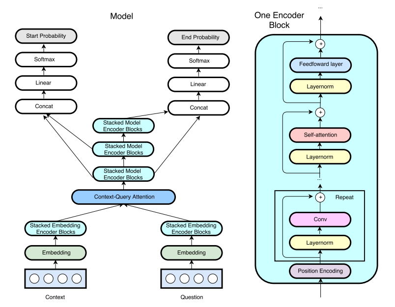

# Quick-NLP
Despite proving to be extremely useful, RNN's and LSTM's are quickly becoming obsolete as newer more efficient networks are being developed. Newer architectures achieve state of the art results and favor the use of attention mechanisms and convolution over recurrent connections. Unfortunately, TensorFlow has been slow to keep up with these rapidly advancing models and many of the existing classes are not easily modifiable to fit the criteria described in recent academic research. To accelerate machine learning discoveries, the models in this library are implemented such that the logic is as transparent and modifiable as possible.

Check out the [website](http://victordu.com/nlp/) and view live [demos](http://victordu.com/nlp/demos.html) of trained models in the browser.

## Contents
* [Installation](#installation)
* [Models](#models)
  * [MLSTM](#mlstm-language-model)
  * [Transformer Decoder Language Model](#transformer-decoder-language-model)
  * [Transformer Entailment](#transformer-entailment)
  * [QANet](#qanet)
* [Datasets](#datasets)
  * [SNLI](#snli)
  * [SQuAD](#squad)
  * [Wikitext](#wikitext)
* [Pre-Trained Vectors](#pre-trained-vectors)
  * [GloVe](#glove)
  * [ELMo](#elmo)
  * [Pre-Trained Language Model](#pre-trained-language-model)
* [Training](#training)
* [Saved Params](#saved-params)
* [Papers](#papers)

## Installation
Just clone the repository and install the dependencies:

```bash
$ git clone https://github.com/VD44/Quick-NLP

$ cd Quick-Nlp-master

$ pip install -r requirements.txt
```
## Models

### MLSTM Language Model

A recurrent baseline model for comparison to feedforward models. mLSTM is proposed in the paper: [Multiplicative LSTM for sequence modeling](https://arxiv.org/pdf/1609.07959.pdf). mLSTM is able to use different recurrent transition functions for every possible input, allowing it to be more expressive for autoregressive sequence modeling. mLSTM outperforms standard LSTM and its deeper variants.

Model defined under [Quick-NLP/models/mlstm_lm.py](https://github.com/VD44/Quick-NLP/blob/master/models/mlstm_lm.py).

Train on wikitext-103 dataset:
```bash
$ bash get_data.sh wikitext

$ python train_mlstm_lm.py
```
### Transformer Decoder Language Model

The decoder component of the architecture described in [Attention Is All You Need](https://s3-us-west-2.amazonaws.com/openai-assets/research-covers/language-unsupervised/language_understanding_paper.pdf). The same model was used to generate Wikipedia articles in [Generating Wikipedia by Summarizing Long Sequences](https://arxiv.org/pdf/1801.10198.pdf). Can be applied to practically any language modeling task. This model is often used for the task of machine summarization, here we use it as a comparison to the mLSTM language model as well as for the task of machine question generation.
<br/>


A single block of the decoder is depicted, by default the model uses 12. The multihead attention is masked such that at every time step the model can only attend to values up until that time step. This maintains the autoregressive property of the model. The authors of [Improving Language Understanding by Generative Pre-Training](https://s3-us-west-2.amazonaws.com/openai-assets/research-covers/language-unsupervised/language_understanding_paper.pdf) found that a model pre-trained on a large corpus of text can be easily fine-tuned to model new tasks. In their experiments they pre-trained a model on 8 P600 GPU's for 30 days. After fine-tuning, their model beat the state of the art for 9 of the 12 studied tasks. We use the pre-trained weights they published from their experiments as a starting point for the language model. Their code is available at: https://github.com/openai/finetune-transformer-lm. 

Model defined under [Quick-NLP/models/transformer_lm.py](https://github.com/VD44/Quick-NLP/blob/master/models/transformer_lm.py).

Pre-trained weights can be imported using:
```bash
$ bash get_data.sh pretrained_lm
# and then train
$ python train_transformer_lm.py
```
### Transformer Entailment
Machine Textual Entailment is the task of labeling a pair of statements as being an entailment, a contradiction, or neutral. In this example we fine-tune a model initialized with the weights described in the Transformer Language Model section above. This model achieves state of the art results at the time of writing. Trained on the [SNLI 1.0](https://nlp.stanford.edu/projects/snli/) corpus. 

Model defined under [Quick-NLP/models/transformer_clf.py](https://github.com/VD44/Quick-NLP/blob/master/models/transformer_clf.py).

Train with:
```bash
$ bash get_data.sh pretrained_lm snli

$ python train_transformer_snli.py
```
### QANet
QANet is a feedforward model for Machine Reading Comprehension that takes advantage of self attention and convolution to achieve state of the art results (at time of writing). It is more accurate and much more efficient than classical recurrent architectures. It is trained on the [Stanford Question Answering Dataset (SQuAD)](https://rajpurkar.github.io/SQuAD-explorer/). The ensemble model described in [QANet: Combining Local Convolution With Global Self-Attention For Reading Comprehension](https://arxiv.org/pdf/1804.09541.pdf) achieves a higher EM (exact match) score than human performance.
<br/>


The encoder block to the right is used throughout the model, with varying number of convolutional
layers. The use of convolutions allows for the use of layer dropout, a regularization technique commonly used in
ConvNets. The model uses a pre-trained word embedding using 300 dimensional GloVe vectors and a 200 dimensional trainable character embedding.

Model defined under [Quick-NLP/models/qa_net.py](https://github.com/VD44/Quick-NLP/blob/master/models/qa_net.py).

Download pre-trained GloVe vectors using (Common Crawl 300 dimensional truncated to first 400k tokens):
```bash
$ bash get_data.sh glove
```
Train with:
```bash
$ bash get_data.sh squad

$ python train_qa_net.py
```
## Datasets

### SNLI
The SNLI corpus is a benchmark for evaluating natural language inference models. It contained 570k human-written English sentence pairs manually labeled either entailment, contradiction, or neutral. The dataset can be downloaded using:
```bash
$ bash get_data.sh snli
```
The transformer classification model is applied to this task. It uses the pre-trained language model params from https://github.com/openai/finetune-transformer-lm. These weights can be downloaded using:
```bash
$ bash get_data.sh pretrained_lm
# and then train
$ python train_transformer_snli.py
```
### SQuAD
The [Stanford Question Answering Dataset (SQuAD)](https://rajpurkar.github.io/SQuAD-explorer/) is a dataset for machine reading comprehension, questions and passages are created from Wikipedia articles, the answer to every question is a segment of text from the reading passage. Download using:
```bash
$ bash get_data.sh squad
```
The reading comprehension (QANet) and question generation (Transformer Language Model) models are trained on this dataset.
```bash
$ python train_qanet.py
# or
$ python train_transformer_qa_gen.py
```
### Wikitext
The WikiText dataset is a collection of over 100 million tokens extracted Wikipedia articles for machine language modeling. It can be downloaded using:
```bash
$ bash get_data.sh wikitext
```
The Transformer and MLSTM language models are trained on this dataset:
```bash
$ python train_transformer_lm.py
# or 
$ python train_mlstm_lm.py
```
## Pre-Trained Vectors

### GloVe
Pre-trained 300d [GloVe](https://nlp.stanford.edu/pubs/glove.pdf) vectors are available for download. Matrix is truncated to the first 400k tokens. Vectors are used to train QANet.
```bash
$ bash get_data.sh glove
```
### ELMo
Pre-trained 768d [ELMo](https://arxiv.org/pdf/1802.05365.pdf) vectors are available for download. Matrix contains 40k vectors. Used to train mLSTM language model.
```bash
$ bash get_data.sh elmo
```
### Pre-Trained Language Model
Weights from https://github.com/openai/finetune-transformer-lm. Used to train Transformer Language, Transformer SNLI, and Transformer Question Generation models.
```bash
$ bash get_data.sh pretrained_lm
```
## Training
General training params (there are others):
```bash
--desc # training task description
--log_dir # dir where logs will be generated
--save_dir # dir where parameters will be saved
--submission_dir # dir where model will submit test data responses
--use_prev_best # if set, model will use best saved params over regular init
--submit # if set, model will save best params and submit response to test data
--data_limit # truncate data to this amount
--n_gpu # number of gpus to use (set to 1 for cpu)
--n_iter # num epochs
--n_batch # batch size

# example:
$ python train_transformer_lm --n_batch 8 --n_iter 3  --submit
```
## Saved Params
By default, model parameters that achieve the best results will be saved under /master/save/model_description/best_params.jl. Using the --use_prev_best flag during training will cause the model to use the previous best saved parameters instead of the regular parameter initialization.
## Papers:
Main papers used as references:
* [Attention Is All You Need](https://arxiv.org/pdf/1706.03762.pdf)
* [Improving Language Understanding by Generative Pre-Training](https://s3-us-west-2.amazonaws.com/openai-assets/research-covers/language-unsupervised/language_understanding_paper.pdf)
* [QANet: Combining Local Convolution With Global Self-Attention For Reading Comprehension](https://arxiv.org/pdf/1804.09541.pdf)
* [Learning to Generate Reviews and Discovering Sentiment](https://arxiv.org/pdf/1704.01444.pdf)
* [Generating Wikipedia by Summarizing Long Sequences](https://arxiv.org/pdf/1801.10198.pdf)
* [Deep contextualized word representations](https://arxiv.org/pdf/1802.05365.pdf)
